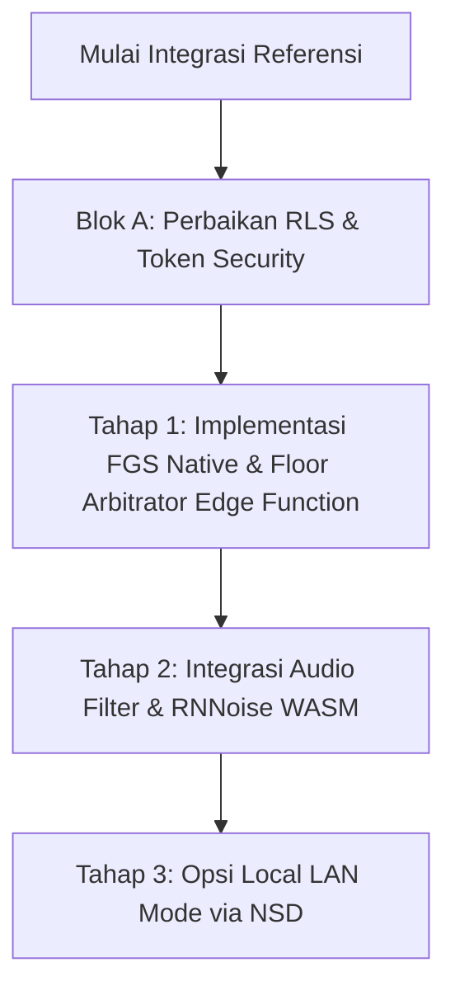

# Analisis Teknis Referensi Open-Source untuk NextVWT

Dokumen ini merangkum temuan arsitektur dan pola kode dari proyek-proyek *open-source* PTT/Walkie-Talkie di GitHub, serta bagaimana kita dapat menerapkannya secara konkret ke dalam codebase **NextVWT**.

---

## 1. Pemetaan Proyek Referensi & Aspek Teknis

| Proyek GitHub | Fokus Utama | Teknologi Utama | Aspek yang Diadopsi untuk NextVWT |
| :--- | :--- | :--- | :--- |
| **`david-spies/ptt-radio`** | WebRTC P2P PTT murni | WebRTC, JS murni, Opus | Manajemen status track audio & penanganan latensi. |
| **`SmartWalkieOrg/voiceping-router`** | SDK & Router PTT Android | Java/Kotlin, Opus, Android SDK | Penanganan *background service* & optimasi konsumsi data seluler. |
| **`codewithmichael/webrtc-intercom`** | Interkom P2P Web | WebRTC, Node.js WebSocket | Struktur signaling minimal untuk koneksi peer. |
| **`devapro/LANwalkieTalkie`** | Walkie-Talkie Wi-Fi Lokal | NSD (Network Service Discovery) | Fitur komunikasi lokal nirkabel (Off-Grid/Local LAN). |
| **`ibnux/PoC-Walkie-Talkie`** | WebSocket PoC | WebSockets, Audio Chunks | Logika fallback transmisi data biner jika WebRTC gagal. |

---

## 2. Penerapan Teknis Spesifik untuk NextVWT

### A. Mekanisme Floor Control & Manajemen Track Audio (WebRTC PTT)
Mengacu pada pendekatan `ptt-radio` dan `webrtc-intercom`, kita dapat mengoptimalkan interaksi tombol PTT agar bebas dari tabrakan (*collision-free*) secara kooperatif di Fase A:

*   **Pola Default Mute:** Semua peer menonaktifkan track mikrofon lokal secara default untuk mencegah kebocoran suara.
    ```typescript
    // Inisialisasi track dengan keadaan dinonaktifkan
    localStream.getAudioTracks().forEach(track => {
      track.enabled = false;
    });
    ```
*   **Transmisi PTT (Hold to Talk):** Saat tombol ditekan (`onMouseDown` / `onTouchStart`):
    1.  Cek status channel melalui Supabase Realtime/state lokal.
    2.  Jika kosong: Aktifkan track audio (`track.enabled = true`), kirim status broadcast `TALKING: user_id`, dan putar *pre-chirp tone*.
    3.  Jika sibuk: Berikan *haptic feedback* penolakan dan tampilkan status "Busy".
*   **Pelepasan PTT (Release to Listen):** Saat tombol dilepas (`onMouseUp` / `onTouchEnd`):
    1.  Matikan kembali track audio (`track.enabled = false`).
    2.  Kirim broadcast `RELEASED`.
    3.  Mainkan bunyi *roger beep* + *squelch tail* lokal.

### B. Kelangsungan Hidup Aplikasi di Background (Android Foreground Service)
Mengacu pada SDK `voiceping-router`, NextVWT memerlukan `PttForegroundService` native untuk menjaga koneksi tetap hidup di Android meskipun layar dikunci.

*   **Implementasi FGS Native (di folder `android/app/src/main/java/`):**
    *   Buat `PttForegroundService` yang mewarisi `Service` Android.
    *   Deklarasikan tipe layanan sebagai `microphone` dan `dataSync` di `AndroidManifest.xml` (sudah dideklarasikan di codebase saat ini).
    *   Gunakan `NotificationCompat.Builder` untuk menampilkan notifikasi persisten "NextVWT Siaga - Channel [X]".
*   **Pencegahan Doze Mode:**
    *   Gunakan `PowerManager.WakeLock` untuk menjaga CPU tetap aktif saat mendengarkan transmisi masuk.
    *   Gunakan **FCM High-Priority Data Messages** untuk membangunkan *service* dari mode tidur nyenyak (*deep sleep*) ketika ada transmisi darurat (Emergency Override).

### C. Penanganan Jaringan Fluktuatif & Codec Adaptif
Pekerja lapangan seperti driver Ojol (Andi) dan kurir (Siti) sering berpindah-pindah area dengan sinyal seluler yang tidak stabil.

*   **Opus Codec Tuning:** Mengoptimalkan pengaturan WebRTC peer connection agar menghemat kuota dan toleran terhadap *packet loss*.
    ```javascript
    // Modifikasi SDP untuk membatasi bitrate Opus & mengaktifkan In-band Forward Error Correction (FEC)
    const setOpusParameters = (sdp) => {
      return sdp.replace(
        "useinbandfec=1",
        "useinbandfec=1; maxaveragebitrate=24000; cbr=0" // Batasi bitrate ke 24kbps (hemat kuota)
      );
    };
    ```
*   **Fallback Audio Chunks (Base64/Binary):** Jika WebRTC terputus akibat NAT seluler yang ketat:
    *   Gunakan pencuplikan biner audio pendek 200ms.
    *   Kirimkan potongan audio tersebut via WebSocket / Supabase Realtime secara berurutan seperti yang dicontohkan pada proyek `PoC-Walkie-Talkie`.

### D. Fitur Off-Grid (Local Wi-Fi Walkie-Talkie)
Mengadopsi logika `LANwalkieTalkie` menggunakan Network Service Discovery (NSD) Android untuk skenario darurat atau wilayah tanpa sinyal internet (Relawan SAR - Bambang).

*   **Pola Kerja NSD:**
    1.  **Registrasi Layanan:** Saat berada di mode LAN, perangkat mendaftarkan dirinya ke jaringan lokal.
    2.  **Discovery:** Perangkat lain mencari layanan dengan tipe `_nextvwt_ptt._tcp` di jaringan yang sama.
    3.  **Koneksi:** Lakukan *streaming* audio via soket UDP/TCP lokal langsung antar alamat IP lokal tanpa melewati internet.

---

## 3. Rencana Aksi Implementasi pada Codebase NextVWT



1.  **Langkah 1 (Kritis):** Terapkan mitigasi penanganan kebocoran credential dan perbaiki aturan RLS Supabase sesuai dengan *Runbook Blok A*.
2.  **Langkah 2 (Stabilitas Audio & Background):** Bangun kelas `PttForegroundService.java` di sisi native Android untuk membungkus WebView Capacitor agar audio tetap dapat mengalir secara real-time.
3.  **Langkah 3 (Peningkatan Audio):** Integrasikan filter High-Pass Filter (HPF) <150Hz di sisi client React untuk meredam gemuruh angin dan motor (sangat penting untuk Persona Andi - Driver Ojol).
